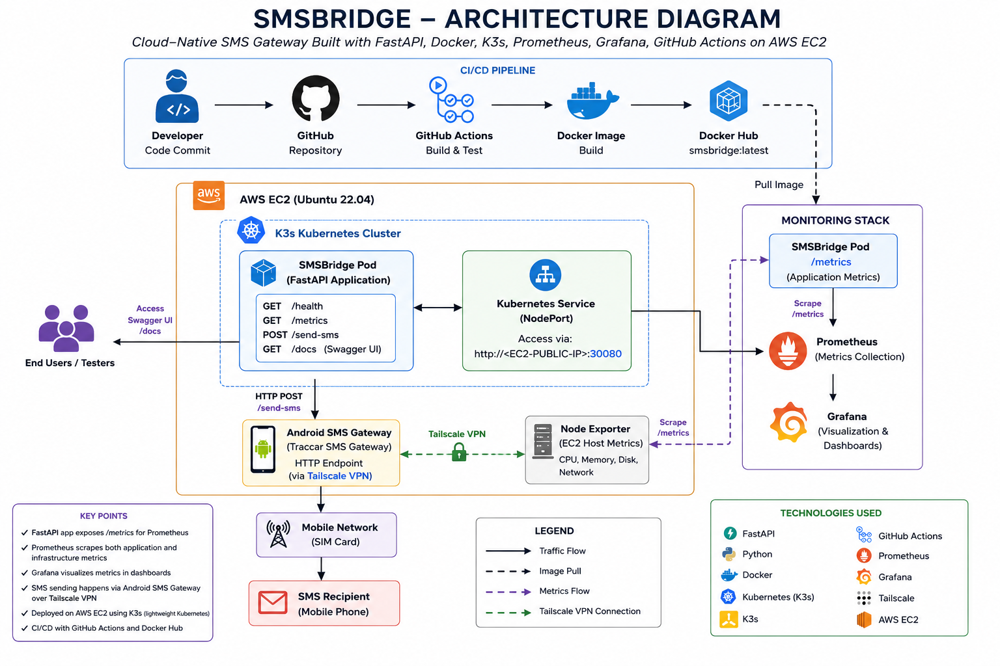
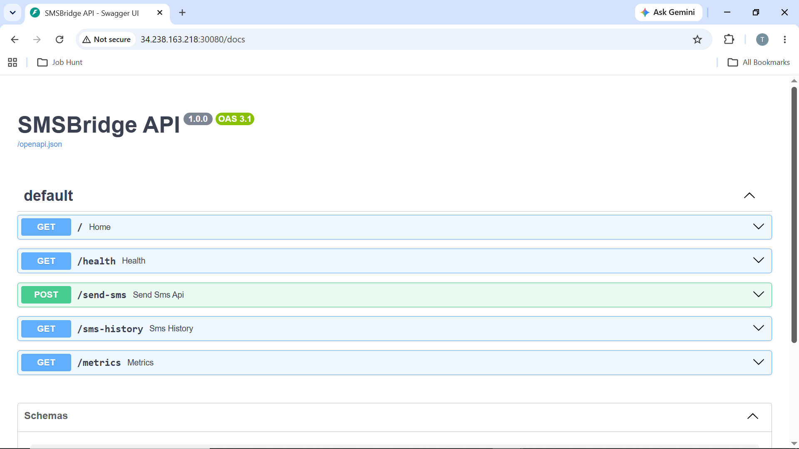
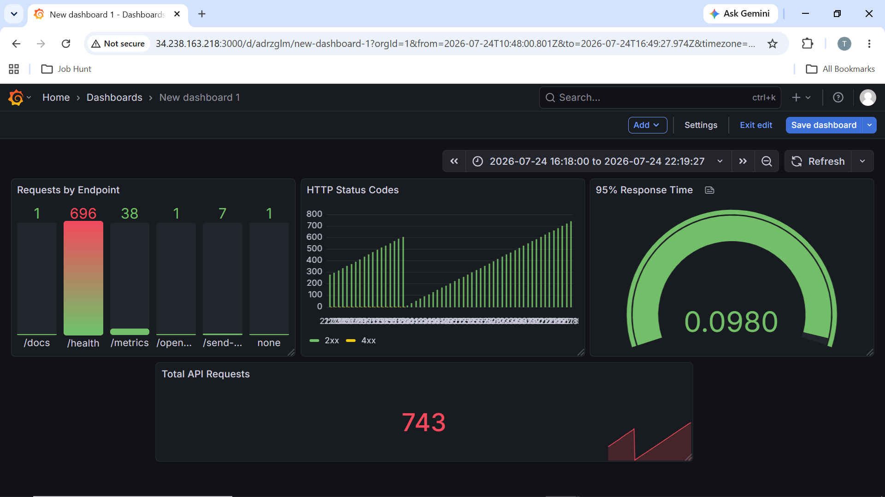
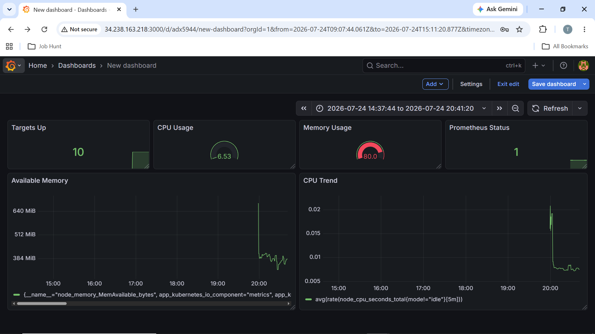
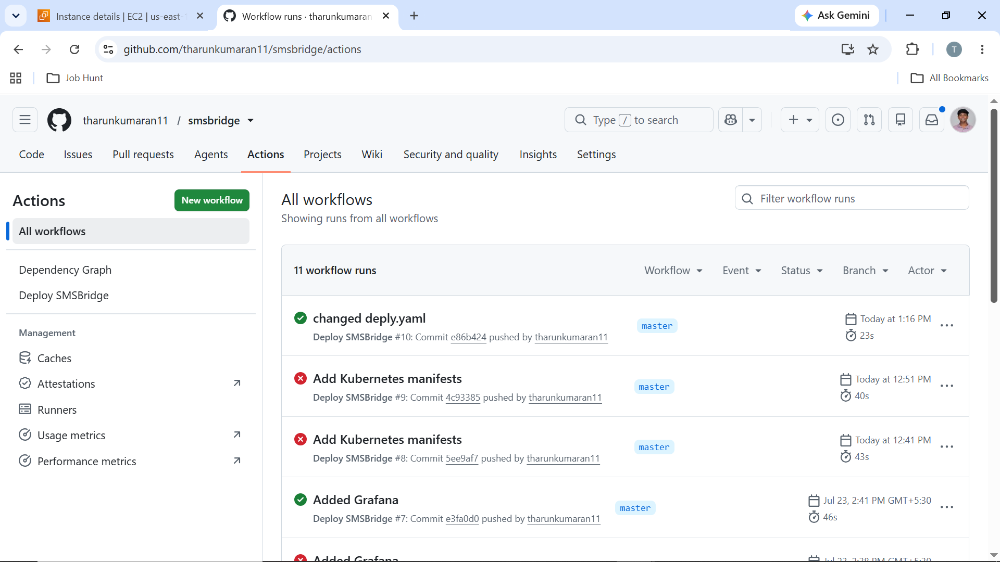

# 📱 SMSBridge

> Production-ready SMS Gateway API built with **FastAPI**, **Docker**,
> **K3s Kubernetes**, **AWS EC2**, **GitHub Actions**, **Prometheus**,
> **Grafana**, **Docker Hub**, **Tailscale**, and **Android Traccar SMS
> Gateway**.


------------------------------------------------------------------------

# 🚀 Overview

SMSBridge is a cloud-native SMS Gateway API that securely sends SMS
messages through an Android device running the **Traccar SMS Gateway**
application.

The project is containerized using Docker, deployed on an AWS EC2
instance with a lightweight K3s Kubernetes cluster, automated through
GitHub Actions, monitored using Prometheus and Grafana, and connected
securely to the Android gateway using Tailscale.

------------------------------------------------------------------------

# ✨ Features

-   REST API built with FastAPI
-   Interactive Swagger UI
-   API Key Authentication
-   SMS Sending Endpoint
-   SMS History Endpoint
-   Health Check Endpoint
-   Prometheus Metrics
-   Dockerized Deployment
-   Kubernetes (K3s)
-   GitHub Actions CI/CD
-   Docker Hub Integration
-   AWS EC2 Deployment
-   API Monitoring
-   Infrastructure Monitoring
-   Secure communication using Tailscale

------------------------------------------------------------------------

# 🏗 Architecture

Replace with your generated diagram:

 text
screenshots/architecture.png


 md
<p align="center">

</p>


------------------------------------------------------------------------

# 🧰 Tech Stack

  Category        Technology
  --------------- -----------------------------------
  Backend         FastAPI
  Language        Python
  Container       Docker
  Orchestration   K3s Kubernetes
  Cloud           AWS EC2
  CI/CD           GitHub Actions
  Registry        Docker Hub
  Monitoring      Prometheus + Grafana
  Metrics         prometheus-fastapi-instrumentator
  VPN             Tailscale
  SMS Gateway     Android Traccar SMS Gateway

------------------------------------------------------------------------

# 📂 Project Structure

``` text
smsbridge/
├── app/
├── k8s/
├── .github/workflows/
├── screenshots/
│   ├── architecture.png
│   ├── api-swagger.png
│   ├── api-dashboard.png
│   ├── infrastructure-dashboard.png
│   ├── github-actions.png
│   └── dockerhub.png
├── Dockerfile
├── requirements.txt
├── README.md
└── LICENSE
```

------------------------------------------------------------------------

# 📚 API Endpoints

  Method   Endpoint       Description
  -------- -------------- --------------------
  GET      /              Home
  GET      /health        Health Check
  POST     /send-sms      Send SMS
  GET      /sms-history   SMS History
  GET      /metrics       Prometheus Metrics
  GET      /docs          Swagger UI

------------------------------------------------------------------------

# 📖 Swagger UI

 md
<p align="center">

</p>


------------------------------------------------------------------------

# 📈 API Monitoring

Displays: - Total API Requests - Requests by Endpoint - HTTP Status
Codes - 95th Percentile Response Time

 md
<p align="center">

</p>


------------------------------------------------------------------------

# 🖥 Infrastructure Monitoring

Displays: - CPU Usage - Memory Usage - Prometheus Status - Available
Memory - CPU Trend

 md
<p align="center">

</p>


------------------------------------------------------------------------

# 🚀 CI/CD

Workflow: 1. Push code to GitHub 2. GitHub Actions builds Docker image
3. Image pushed to Docker Hub 4. Kubernetes deployment updated

 md
<p align="center">

</p>


------------------------------------------------------------------------

# 🐳 Docker Hub

 md
<p align="center">

</p>


------------------------------------------------------------------------

# 🔒 Security

-   API Key Authentication
-   Kubernetes Secrets
-   Tailscale encrypted network
-   Docker image deployment

------------------------------------------------------------------------

# 📌 Future Improvements

-   JWT Authentication
-   SMS Delivery Reports
-   Rate Limiting
-   Helm Charts
-   HTTPS with TLS
-   Horizontal Pod Autoscaling

------------------------------------------------------------------------

# 👨‍💻 Author

**Tharun Kumaran**

GitHub: https://github.com/tharunkumaran11

------------------------------------------------------------------------

## ⭐ If you found this project useful, please consider giving it a star.
